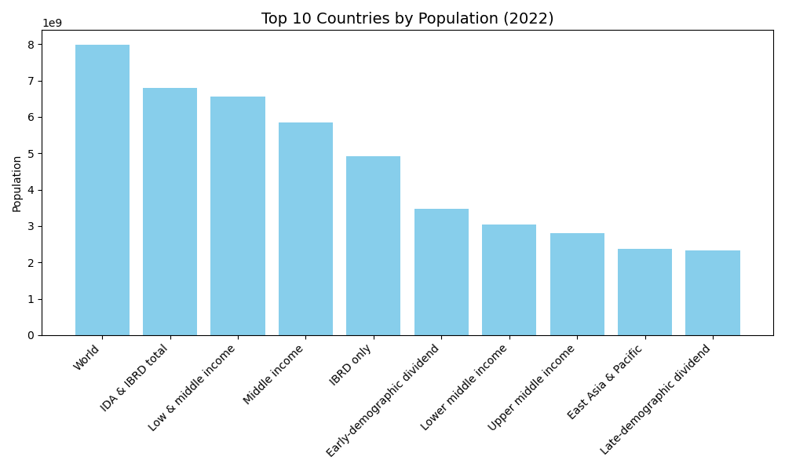

# PRODIGY_DS_01 - Population Distribution Bar Chart

## 📌 Task Overview

This repository contains my first task as a **Data Science Intern** at **Prodigy InfoTech**.

**Task**:  
Create a bar chart or histogram to visualize the distribution of a categorical or continuous variable, such as the distribution of ages or genders in a population.

**Dataset Source**:  
[World Bank - Total Population](https://data.worldbank.org/indicator/SP.POP.TOTL)

---

## 📊 Project Description

For this task, I created a **bar chart** to visualize the **top 10 most populous countries** based on 2022 data from the World Bank. The goal was to explore basic data visualization and improve familiarity with real-world data.

---

## 🛠️ Tools & Technologies

- **Python**
- **Pandas** for data handling
- **Matplotlib** for visualization
- **Jupyter Notebook** / Python Script

---

## 📈 Output

---

## 📚 Key Learnings

- How to load and preprocess CSV data
- Sorting and selecting relevant data with Pandas
- Creating bar charts using Matplotlib
- Labeling and formatting plots for clarity

---

